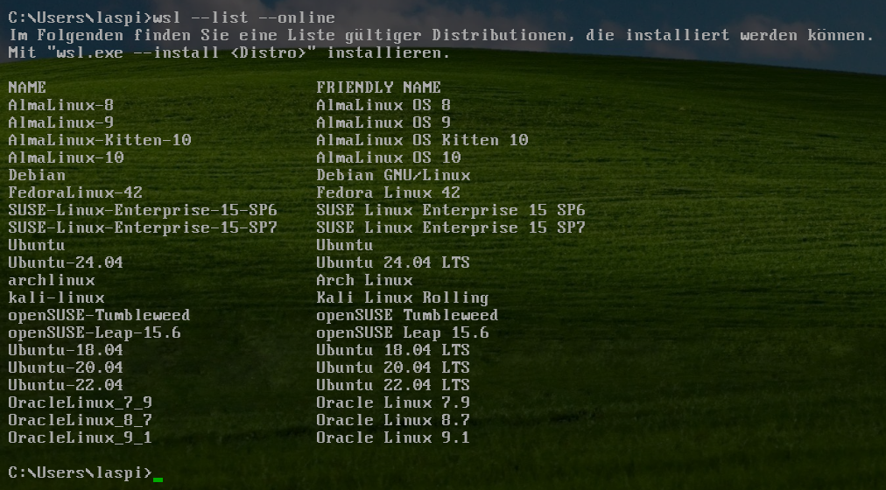
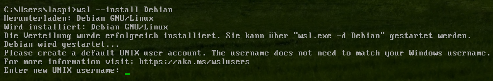
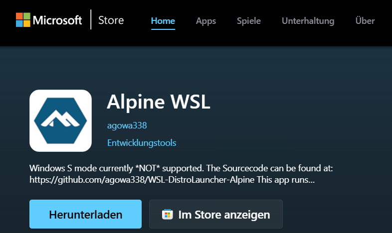
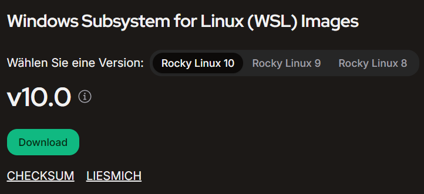
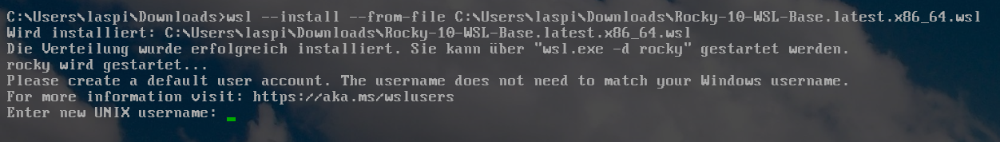
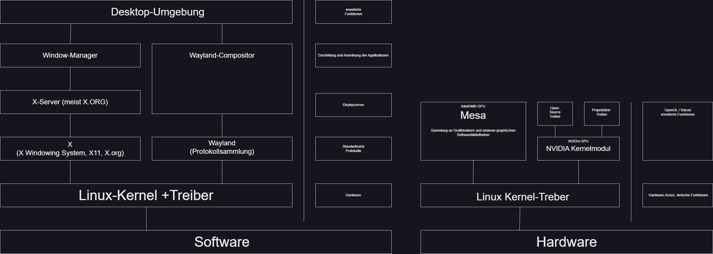

# Linux

## Inhaltsverzeichnis

**1. [Inhaltsverzeichnis](https://github.com/Delfi-CH/linux.md/blob/main/linux.md#inhaltsverzeichnis)**

**2. [Wichtige Begriffe](https://github.com/Delfi-CH/linux.md/blob/main/linux.md#wichtige-begriffe)**

**3.**

- **3a. [Was ist Linux](https://github.com/Delfi-CH/linux.md/blob/main/linux.md#was-ist-linux)**

- **3b. [Übersicht der grossen Linux-Distributionen](https://github.com/Delfi-CH/linux.md/blob/main/linux.md#%C3%BCbersicht-der-grossen-linux-distributionen)**

**4.**

- **4a. [Linux installieren](https://github.com/Delfi-CH/linux.md/blob/main/linux.md#linux-installieren)**

- **4b. [Möglichkeiten](https://github.com/Delfi-CH/linux.md/blob/main/linux.md#m%C3%B6glichkeiten)**
 
- **4c. [Installation](https://github.com/Delfi-CH/linux.md/blob/main/linux.md#installation)**

**5. [Vorteile von Linux](https://github.com/Delfi-CH/linux.md/blob/main/linux.md#die-vorteile-von-linux)**

**6. Der Linux Grafik-Stack**

--------
Bei Fragen bitte an L. Spitzer (Delfi-CH) melden.

Pull Requests und Contributions sind erwünscht.

## Wichtige Begriffe:
| Begriff | Definition |
| - | - |
| Freie Software | Freie Software ist eine Software, welche die Freiheiten des Benutzers, wie die Freiheit die Software zu verteilen, untersuchen und modifizieren.|
| Open-Source | Open-Source Software ist Software, bei welcher der Quellcode öffentlich verfügbar ist (bsp. auf GitHub) und jeder diesen untersuchen und modifizieren kann. Da sich einige Ziele von Open-Source und Freier Software überschneiden, ist Freie Software meist auch Open-Source Software.|
| Kernel | Ein Kernel ist der Kern eines Betriebssystems. Er ist für viele hardware-nahe Prozesse zuständig und bildet eine Basis, worauf andere Software darauf aufbaut. Der Endbenutzer interagiert fast nie mit dem Kernel. |
| Userspace / Userland | Das Userland ist der Teil des Betriebssystems, mit welchem der Endbenutzer interagiert (bsp. Terminal, Graphische Oberfäche, Applikatoionen, etc..). |
| UNIX | UNIX ist ein Betriebssystem, welches 1969 in den Bell Labs des Mobilfunkandbieters AT&T entwickelt wurde. Wichtige Konzepte, welche heute noch relevant sind, wie das "Stammverzeichniss", "Alles ist eine Datei" und die Shell stammen von UNIX. Viele wichtige Betriebssysteme haben ihren Anfang in UNIX. |
| UNIX-ähnich | Ein UNIX-ähnich Betriebssystem ist ein Betriebssystem, welches versucht, sich ähnlich wie UNIX zu verhalten, aber nicht UNIX ist.|
| Shell | Die Shell (oft auch UNIX-Shell, Konsole, Kommandozeile oder Terminal genannt) ist ein texbasiertes User-Interface sowie ein Interpret für Shell-Scrips, welches in jedem UNIX oder UNIX-ähnlichem Betriebssystem vorhanden ist. |
| Interpret und Kompilierer | Bevor ein Computer Code ausführen kann, muss dieser von für menschlich lesbaren Programmiersprachen (C, JAVA, JAVAScript, Python, Rust, etc.) zu Binär übersetzt werden. Interpret und Kompilierer sind Software, welche genau dies (in unterschiedlichen Wegen) machen. |
|Kernutensilien| Die Kernutensilien sind eine Gruppe an einfachen, aber wichtigen Kommandozeilen-Applikatonen, welche in jedem UNIX und UNIX-ähnlichen Betriebssystem vorhanden sind. Es gibt viele Implementierungen der Kernutensilien von verschieden Projekten(bsp. GNU Coreuitls, Busybox, BSD Coreutils, etc..) |
| GNU-Projekt | Das GNU-Projekt (GNU ist ein rekursives Akronym: "GNU's  not UNIX" (DE: GNU ist nicht UNIX)) hat das Ziel, ein UNIX-ähnliches Betriebssystem, welches unter einer Freien Software Lizenz lizensiert ist, zu erstellen. Neben einem eigenen Kernel (GNU Hurd), wurden auch eigene Kernutensilien (GNU Coreutils), ein eigener Kompilierer für C, C++ und weiteren Sprachen (GCC) und eine eigene Shell (BASH) für dieses Betriebssystem erstellt. |
|GNU GPL| Die GNU GPL (GNU General Public License) ist eine Freie Software Lizenz, welche dem Endbenutzer die Rechte gibt, die Software ohne Einschränkungen zu benutzen, den Quellcode zu untersuchen, Modifikationen an der Software forzunehmen, sowie die ursprüngliche und modifizerte Software unter der GNU GPL weiterzuverbreiten |
| Distribution | Eine Software-Distribuion ist eine Sammlung von Paketen / Software, um die Nutzug und Installation einer bestimmten Software zu vereinfachen |
| Pakete / Paktet-Manager | In den meisten Linux-und UNIX-ähnlichen Systemen wird Sofware als ein Paket über einen Paktet-Manager installiert. Je nach Distribution werden Pakete unterschildich installiert. |

## Was ist Linux

Linux ist ein Unix-ähnlicher Kernel, welcher von Linus Torvalds als Hobbyprojekt entwickelt wurde und 1991 zuerst unter einer selbstgeschrieben Lizenz von Torvalds,  später unter der GNU General Public License Version 2 herausgebracht wurde.

Umgangsprachlich wird aber mit Linux meist ein vollstänges Betriebssystem / eine Linux-Distribution gemeint.

Eine Linux-Distribution besteht aus: dem Linux Kernel, einer Implementierung der Kernutensilien einer Shell, sowie meist noch mehr Software, wie Texteditoren, weitere Kommandozeilen-Applikatonen, eine graphishe Benutzeroberfläche, etc.. Meistens werden für die Kernutensilien sowie die Shell die Implementierung des GNU-Projekts benutzt, da diese unter einer Freien Software Lizenz verfügbar sind. Deshalb wird manchmal Linux auch als GNU/Linux bezeichnet

Da der Linux-Kernel, sowie die Software welche oft mit diesem verwendet wird, unter der GNU GPL lizensiert sind, führt dieses zu grosser Flexibilität bei der Verwendung, wodurch Linux auf fast allem für fast alles gebaucht werden kann. Viele Firmen benutzen Linux, beispielweise auf Servern, sowie laufen viele Smart-Geräte (Fernseher, Router) auf Linux.

### Übersicht der grossen Linux-Distributionen

 | Name | Erscheinungsdatum | Basiert auf | Eigenschaften | Versionszyklus | Paketverwaltung | Nutzungszweck | Sonstiges |
| - | - | - | - | - | - | - | - |
| Debian GNU/Linux| 1993 | nichts | legt starken Wert auf Freie Software, stabile Software | Neue Version alle 2 Jahre mit Bugfixes dazwischen. | dpkg via apt | Desktop-Betriebssystem, Server | wird von der Gemeinschaft entwickelt |
| Ubuntu Linux | 2004 | Debian | Benutzerfreunlichkeit, Barrierefreiheit | Neue Version alle 6 Monate, Neue LTS*-Versionen alle 2 Jahre | dpkg via apt, Snap | Desktop-Betriebssystem, Server, Unternehmen | wird von der Firma Canonical herausgegeben |
| Fedora Linux | 2003 | RedHat Linux | legt starken Wert auf Freie Software | Neue Version alle 6 Monate, | rpm via dnf, Flatpak | Desktop-Betriebssystem, Server | wird von der Gemeinschaft entwickelt, aber von der Firma RedHat gesponsort | 
| Red Hat Enterprise Linux | 2002 | nichts | kommerziell, kostet Geld, stabil, sicher, zuverlässig | Neue Version alle 3 Jahre, welche für 10 Jahre unterstützt werden | rpm via dnf, Flatpak | Grosse Unternehmen | - |
| Arch Linux | 2002 | nichts | KISS: "Keep it simple Stupid", minimale Grundinstallation | Rolling Release, d.h. Software wird geupdated, wenn ein Update verfügbar ist | pacman, Flatpak, Snap | Deskop-Betiebsystem | grosse Gemeinschaft und Wiki, nicht für Einsteiger geignet |

Um weitere Linux-Distributionen zu finden lohnt es sich die Website [https://distrowatch.com/](https://distrowatch.com/) zu besuchen.

Für unsere Zwecke wird [Ubuntu](https://ubuntu.com/desktop), oder eine Disrtribution, welche auf Ubuntu basiert (beispielsweise [Linux Mint](https://linuxmint.com/)) empfohlen.

## Wie kann ich Linux benutzen

## Linux installieren

### Möglichkeiten

Es gibt 3 verschiedene Wege, auf einem x86-Intel/AMD PC Linux zu installiern.
- Das Windows Subsystem for Linux führt eine einfache Virtuelle Maschiene aus, wodurch die Linux-Shell (BASH, ZSH, etc..) durch ein Windows-Terminal aufgerufen werden kann.
- Linux kann auch in einer "klassischen" Virtuellen Maschiene wie VMWare oder VirtualBox ausgeführt werden, wodurch ein vollständiges Linux System innerhalb von Windows ausgeführt wird.
- Bei einem Dualboot wird Linux auf einer seperaten Partition auf dem Computer installiert, wodurch es komplett unabhängig auf dem Computer läuft. Um von Linux auf Windows und umgekehrt zu wechseln, muss der Computer neugestartet werden.

| - | Windows Subsystem for Linux (WSL) | Virtuelle Maschine (VM) | Dualboot |
| - | - | - | - |
| Graphische Benutzeroberfläche | Nein, aber einzelne graphische Applikationen können ausgeführt werden | Ja, aber langsam | Ja |
| Zugriff auf Windows Dateien | Ja, kompletter Zugriff auf das Windows-Dateisystem | Ja, durch geteilte Ordner | Ja, durch NTFS Treiber |
| Geschwindigkeit | Langsam, da über Hypervisor* | Langsam, da über Hypervisor* | Schnell, da es direkt auf der Hardware läuft |
|Schwierigkeitsgrad 1-10 | 5 | 7 | 8 | 
Empfehlungsgrad 1-10 | 7 | 6 | 8 |
Total 1 - 10 | 8 | 7 | 9 |

*Der Hypervisor ist die Software, die die Kommunikation zwischen Hardware und VM ermöglicht. In den meisten Fällen handelt es sich um einen Type-2-Hypervisor, da er auf dem sogenannten Host OS, also der primären Windowsinstallation, läuft und über diese mit der Hardware kommunizieren muss.

### Installation

- WSL (empfohlen):
    - Voraussezungen: Windows 10/11, circa 10GB freier Speicherplatz
    - WSL sollte bereits von der ZIP-Aufgabe installiert sein
    - **WICHTIG:** Docker Desktop läuft über WSL, ist aber **KEINE** volle Linux-Distribution
    - Fall dies nicht der Fall ist: 
    1. In einem Windows-Terminal ```wsl  --install``` ausführen. Dies sollte Ubuntu WSL installieren. WSL kann danach über ```wsl``` im Terminal gestartet werden.
    - Andere Linux-Distributionen können entweder durch
        - ```wsl --list --online``` gesucht werden und mit ```wsl --install [Distributionsname]``` installiert werden.
        - 
        - 
        - den Microsoft Store installiert werden.
        - 
        - oder durch eine .wsl Datei mit ```wsl --install --from-file {Pfad zur .wsl Datei}``` installiert werden.
        - 
        - 
        
    - Um unterschidliche Distributionen zu starten , in einem Terminal ```wsl -d [Distributionsname]``` ausführen.
    - Um eine Distribution zu entfernen, ```wsl --unregister [Distributionsname]``` ausführen
- Virtuelle Maschiene
    - Voraussezungen: Windows 10/11, circa 30GB freier Speicherplatz
    1. Oracle VirtualBox oder VMWare Workstation installieren.
    2. .iso Datei der Linux-Distributon herunterladen.
    3. Neue Virtuelle Maschiene erstellen und mit der .iso Datei als virtuelle CD/DVD starten.
    4. Linux-Distibution installieren (siehe Dualboot Schritte 9-10)
- Dualboot
    1. Voraussetzungen: 8GB oder grösser USB-Stick, circa 50GB Speicherplatz empfohlen, Mindestspeicherplatz variert je nach Distibution.
    2. .iso Datei der Linux-Distributon herunterladen.
    3. .iso Datei mit Rufus, baleaner Etcher oder anderer Software auf USB flashen
    4. In Windows BitLocker deaktivieren
    5. Gerät neustarten
    6. BIOS/UEFI Firmware starten (kann meist über das wiederholte Drücken von F1, F2, F12 oder Delete beim Aufstarten des Computers ereicht werden)
    7. USB HDD als oberste Boot-Priorität setzen.
    8.  Gerät neustarten
    9. Linux sollte in ein Live-Enviroment starten.
    - Sollte dies nicht funktionieren:
        - In BIOS/UEFI Firmware SecureBoot deaktivieren.
    10. Linux duch das Live-Enviroment installieren.

## Die Vorteile von Linux

- **Freie, Open-Source Software**
    
    Da Linux-Distributionen fast immer aus Freier, Open-Source Software bestehen, bietet dies viele Vorteile. Da der Quellcode öffentlich verfügbar ist, kann dieser auf Fehler sowie Sicherheitsrisiken untersucht und ausgebessert werden.

    - **Privatsphäre**
        
        Dank des öffentlich verfügbarem Quellcodes sowie der fehlender Involvierung grosser Firmen in den meisten Distributionen bieten viele Distributionen eine bessere Privatsphäre als Windows oder MacOS da keine Spyware vorhanden ist.

- **Leistung**
    - Durch die fehlende Spyware, der grossen Auswahl an Software und der grossen Gemeinschaft haben die meisten Distributionen eine (minimal) bessere Leistung als andere Betriebsysteme


## Der Linux Grafik-Stack



Lorem ipsum dolor sit amet, consetetur sadipscing elitr, sed diam nonumy eirmod tempor invidunt ut labore et dolore magna aliquyam erat, sed diam voluptua. At vero eos et accusam et justo duo dolores et ea rebum. Stet clita kasd gubergren, no sea takimata sanctus est Lorem ipsum dolor sit amet. Lorem ipsum dolor sit amet, consetetur sadipscing elitr, sed diam nonumy eirmod tempor invidunt ut labore et dolore magna aliquyam erat, sed diam voluptua. At vero eos et accusam et justo duo dolores et ea rebum. Stet clita kasd gubergren, no sea takimata sanctus est Lorem ipsum dolor sit amet.
